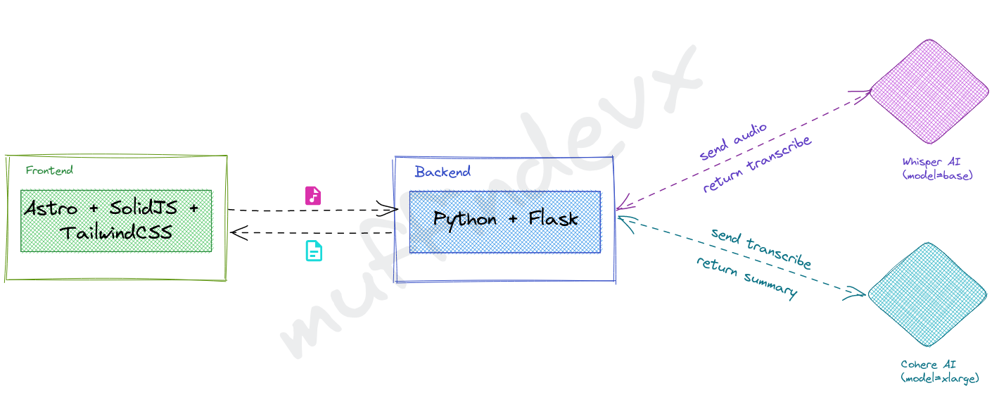

## Intro

This project was built to participate in the COHERE hackaton. In this project, I built a web application
to transcribe and summary audios. For this project, I used differents technologies such as: Python, Flash and Docker for the backend.



## Install

To run the project, we need to install those tools and packages

### General

1. [Python3](https://www.python.org/downloads/)
2. [PIP](https://pip.pypa.io/en/stable/installation/)
3. [PNPM](https://pnpm.io/installation)
4. [Docker](https://docs.docker.com/get-docker/)
5. [Whisper](https://github.com/openai/whisper#setup)

### Ubuntu

#### Install Python 3.10

```bash
sudo add-apt-repository ppa:deadsnakes/ppa
sudo apt update
sudo apt install python3.10
```

#### Install PyPI

```bash
python3 -m pip
```

#### Install Packages

```bash
   pip3 install -U Flask cohere waitress flask-cors
```

#### Install Whisper

```bash
sudo apt update && sudo apt install ffmpeg

pip3 install -U openai-whisper
```

## Usage

1. In your terminal you can run this command to start the backend proyect.

```bash
$ CORS=['localhost:3000'] API_TRIAL_KEY=[KEY_COHERE] --fp16 False python3 app.py
```

2. You can run docker. Remember you need to add variables to .env

```bash
docker build # build image
docker compose up # start service
docker compose down # stop service
```

After that, you can check if the API is ready, navigate to http://localhost:8080/api/status

To check the summary process, you can test this use curl:

```bash
# Summarize an audio
curl -F audio=@'File.[mp3, mp4, wav]' -A "Mozilla/5.0" http://127.0.0.1:8080/api/summarize
```
